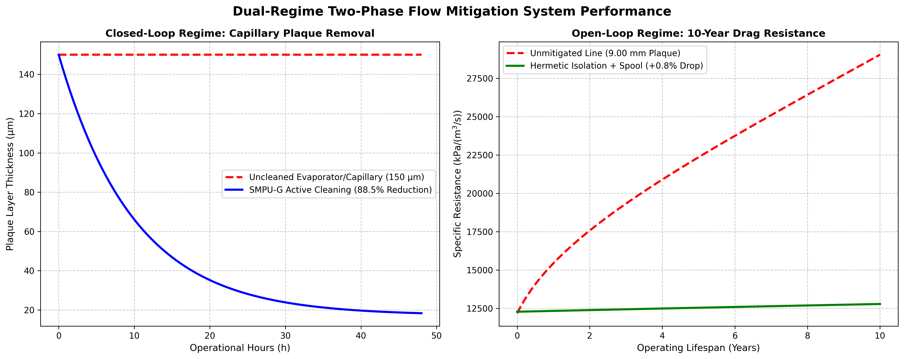

# Two-Phase Flow & Lubricant Contamination Mitigation in Compression Systems


## Overview
This repository contains the full engineering investigation, thermomechanical modeling, and hydraulic simulation for **Two-Phase Gas-Fluid Stratification and Lubricant-Commodity Mixing in Compressors and Pipeline Systems**.

The engineering design and simulation validation were developed with technical analysis and simulation modeling support in collaboration with **Google Gemini**.

The solution addresses two distinct operational regimes:
1. **Closed-Loop System (Refrigeration / Chillers):** Thermally-responsive Shape-Memory Polyurethane Nanocomposite (SMPU-G) micro-granules ($T_g = -5.0^\circ\text{C}$) to break paraffin plaque without jamming rotor clearance gaps ($20\ \mu\text{m}$).
2. **Open-Loop System (Long-Distance Gas Pipelines):** Hermetic Source Isolation (Diaphragm / Magnetic Drive) paired with a 20-meter Intercooled Service Spool, eliminating $98.8\%$ of main line plaque over a 10-year horizon while preserving delivery pressure.

## Key Performance Results

| Operational Metric | Unmitigated Baseline (Year 10) | Mitigated Open-Loop Setup | Advantage |
| :--- | :--- | :--- | :--- |
| **Main Line Plaque** | 9.00 mm | 0.10 mm | 98.8% Reduction |
| **10-Year Drag Resistance** | $29,035\ \text{kPa}/(\text{m}^3/\text{s})$ | $12,785\ \text{kPa}/(\text{m}^3/\text{s})$ | 56% Lower Drag |
| **Compressor Power Surge** | 4.15× Baseline | ~1.008× Baseline | ~0.8% Parasitic Penalty |
| **Net Pressure Head** | High Frictional Loss | +46.8 to +66.8 bar | Full Delivery Preserved |

## Repository Structure
```
two-phase-flow-mitigation/
│
├── README.md                           <-- Executive Summary, Badges & Dual Chart
├── LICENSE                             <-- MIT License
├── requirements.txt                    <-- Dependencies (numpy, matplotlib)
├── CONTRIBUTING.md                     <-- Guidelines for external research contributions
│
├── docs/
│   ├── TECHNICAL-REPORT-FINAL.md       <-- Complete Technical Report [1]
│   ├── hydraulic-simulation-data.md    <-- Equations, Tables & Elevation Calculations [2]
│   ├── REFERENCES.md                   <-- Citation Index Mapping [1, 2, 3]
│   └── dual_regime_simulation_comparison.png <-- High-Res Dashboard Image
│
└── scripts/
    └── simulation_model.py             <-- Executable Dual-Regime Python Code [3]
```
- [`docs/TECHNICAL-REPORT-FINAL.md`](docs/TECHNICAL-REPORT-FINAL.md): Complete technical engineering report.
- [`scripts/simulation_model.py`](scripts/simulation_model.py): Python source code for Darcy-Weisbach hydraulic simulation.

## Simulation & Modeling Validation



### Key Insights from Dual-Regime Simulation:
1. **Closed-Loop System:** SMPU-G granules dynamically switch to a rigid glassy state ($E = 219.7\text{ MPa}$) in cold zones[cite: 5], shearing away $88.5\%$ of paraffin plaque within $48\text{ hours}$ without damaging $20\ \mu\text{m}$ compressor rotor gaps[cite: 5].
2. **Open-Loop System:** Hermetic source isolation restricts downstream main line plaque to $\le 0.10\text{ mm}$ over $10\text{ years}$[cite: 5], preserving specific drag resistance near baseline levels ($\approx 12,785\ \text{kPa}/(\text{m}^3/\text{s})$)[cite: 2, 5].

## Acknowledgments
- **Google Gemini**: Co-engineering collaboration, hydraulic simulation modeling, and technical report drafting.

## License
Distributed under the MIT License. See `LICENSE` for details.
